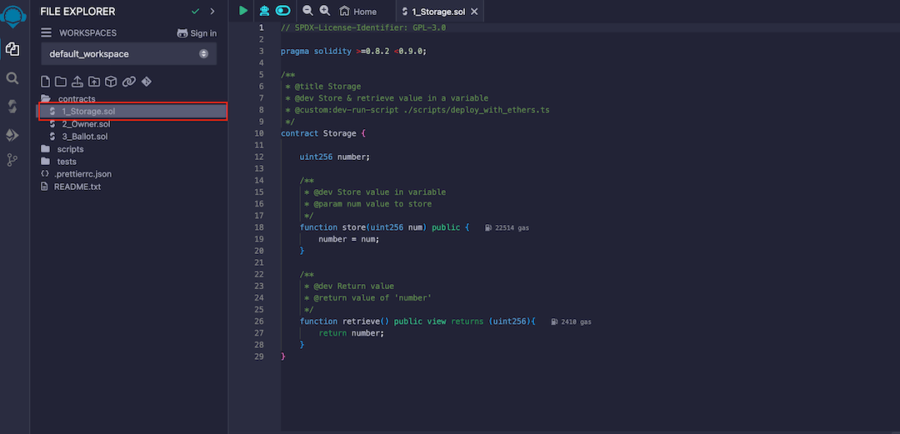
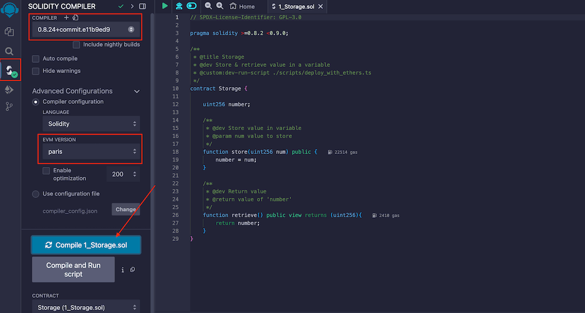
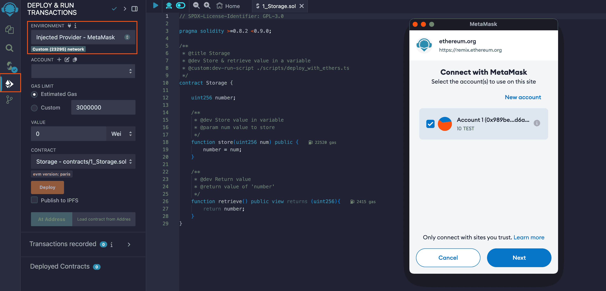
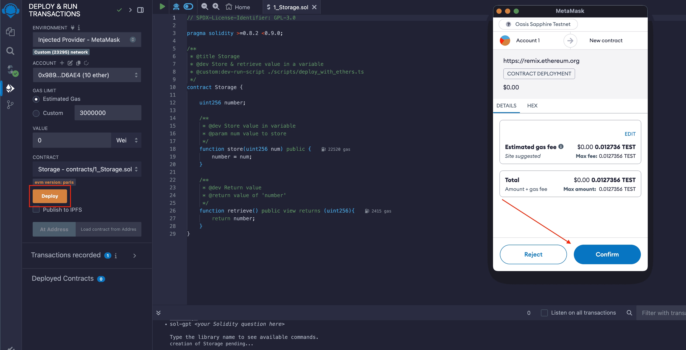

# Remix

## Intro

[Remix] is a web-based Integrated Development Environment (IDE) designed for
developing, testing, and deploying smart contracts on the Ethereum Network.
This guide will show you how to use Remix in conjunction with MetaMask on the
Sapphire Network.

:::info

For comprehensive details about Remix's features, consult the
[Remix documentation].

:::

## Prerequisites

1. Install the [MetaMask browser extension][metamask]
2. Configure your networks:
   - Add Sapphire Mainnet or Testnet to MetaMask using the `Add to MetaMask` button on
  our [network page]
   - (Optional) Configure local network settings if you're using the Sapphire
  [localnet]

## Getting Started

When you first launch Remix, it creates a default project structure.
Navigate to the `contracts` folder and open `1_Storage.sol` to begin.

## Contract Compilation

1. Navigate to the **Solidity Compiler** tab
2. Configure the compiler settings:

   - Compiler version: **`0.8.24`**
   - EVM version: **`paris`** (found under Advanced Configuration)

3. Click `Compile 1_Storage.sol`

:::info Compiler Version

The Sapphire uses the [Rust Ethereum EVM][rust-evm]. This implementation is
compatible with Solidity versions up to **0.8.24**. However, it does not yet
support some transaction types introduced in Solidity **0.8.25**, such as those
mentioned in [rust-ethereum/evm#277][revm-277], pending release of the next version.

:::

:::info EVM Version

EVM versions after **paris** (shanghai and upwards) include the PUSH0 opcode which
isn't supported on Sapphire.

:::

[rust-evm]:https://github.com/rust-ethereum/evm
[revm-277]: https://github.com/rust-ethereum/evm/issues/277

## Contract Deployment

1. Open the **Deploy and Run Transactions** tab.
2. Select `Injected Web3` as environment.
3. Accept in MetaMask the account connection to Remix.

4. Click `Deploy`.
5. Review and confirm the transaction in MetaMask.

If everything goes well, your transaction will be deployed using the selected
account in the MetaMask and the corresponding Sapphire Network.

## Working with Confidential Features

Note that Remix operates without a Sapphire client, meaning transactions and
queries are unencrypted and unsigned by default. To make use of Sapphire's
confidential features, refer to our [Quickstart Tutorial].

[Quickstart Tutorial]: https://github.com/oasisprotocol/docs/blob/main/docs/build/sapphire/quickstart.mdx

Should you have any questions, do not hesitate to share them with us on the
[#dev-central Discord channel][discord].

[localnet]: ./localnet.mdx
[network page]: https://github.com/oasisprotocol/docs/blob/main/docs/build/sapphire/network.mdx#rpc-endpoints
[Remix]: https://remix.ethereum.org
[Remix documentation]: https://remix-ide.readthedocs.io/en/latest/
[metamask]: ../../general/manage-tokens/README.mdx#metamask
[discord]: https://oasis.io/discord
