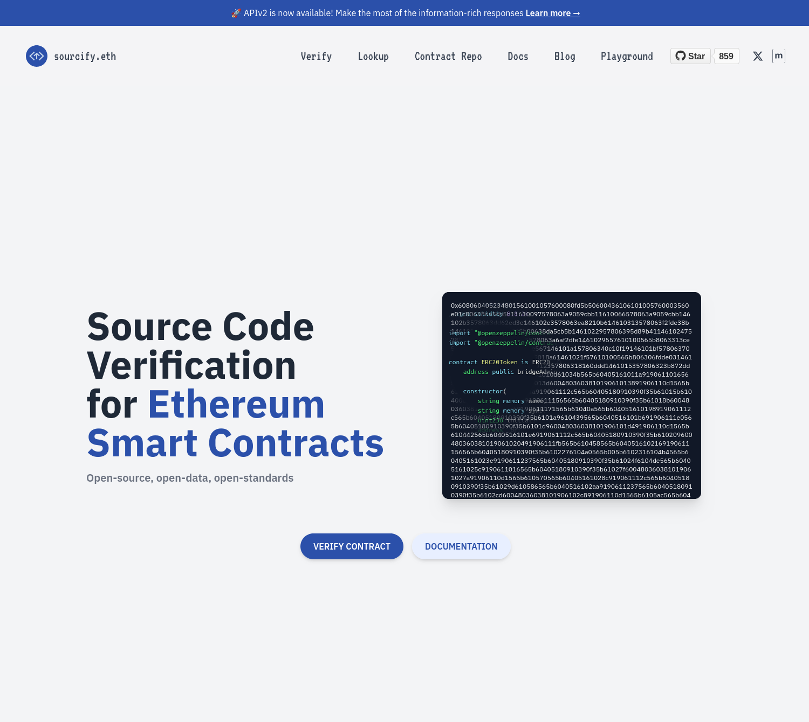
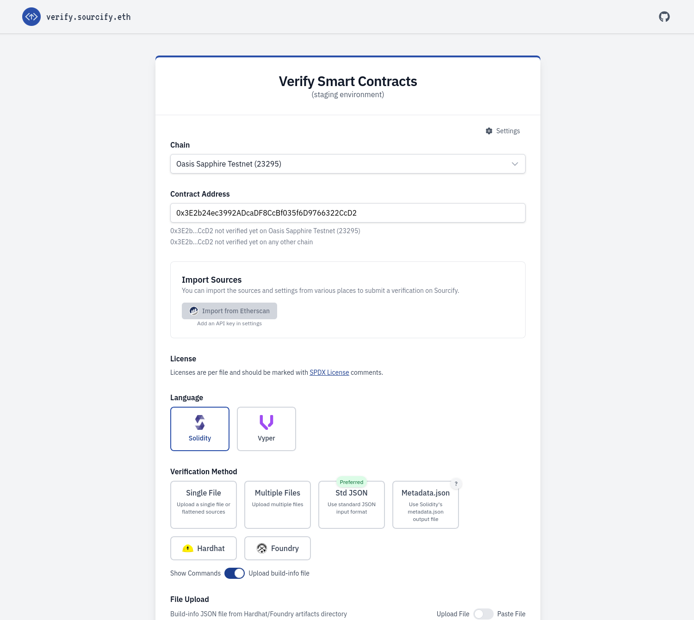
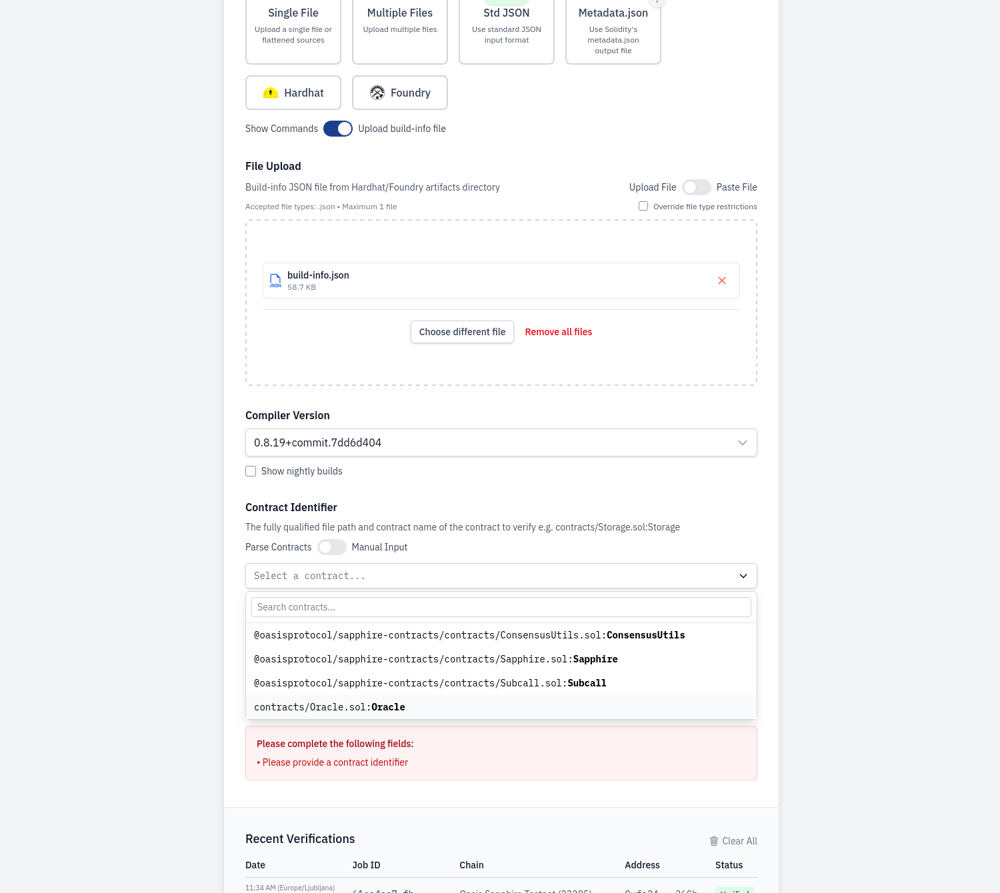

# Contract Verification

[Sourcify] is the preferred service for the [verification of smart
contracts][ethereum-contract-verify] deployed on Sapphire. Make sure you have
the **address of each deployed contract** available (your deployment scripts
should report those) and the **contracts JSON metadata file** generated when
compiling contracts (Hardhat stores it inside the `artifacts/build-info` folder
and names it as a 32-digit hex number). If your project contains multiple
contracts, you will need to verify each contract separately.

:::warning Contract deployment encryption

**Do not deploy your contract with an encrypted contract deployment transaction,
if you want to verify it.** For example, if your `hardhat.config.ts`
or deployment script contains `import '@oasisprotocol/sapphire-hardhat'` or
`import '@oasisprotocol/sapphire-paratime'` lines at the beginning, you should
comment those out for the deployment.

Verification services will try to match the contract deployment transaction code
with the one in the provided contract's metadata. Because the transaction was
encrypted with an ephemeral ParaTime key, the verification service will not be
able to decrypt it. Some services may extract the contract's bytecode from the
chain directly by calling `eth_getCode` RPC, but this will not work correctly
for contracts with immutable variables.

:::

## Verification with Hardhat

If you use Hardhat to deploy your contracts, consider using the
[hardhat-verify] plugin.

To configure it, add the following to your `hardhat.config.ts` file:
  
```js title="hardhat.config.ts"
	etherscan: {
		//  Enabled by default (not supported on Sapphire)
		enabled: false
	},
	sourcify: {
		// Disabled by default
		// Doesn't need an API key
		enabled: true
	}
```

Now you can use the `verify` task:

```shell
pnpm hardhat verify --network sapphire-testnet DEPLOYED_CONTRACT_ADDRESS "Constructor argument 1"
```

[hardhat-verify]: https://hardhat.org/hardhat-runner/plugins/nomicfoundation-hardhat-verify

## Verification with Foundry

[Foundry] natively supports Sourcify verification. To use **Sourcify** as a
provider, specify it with the `--verifier` option.

Example:

```shell
forge verify-contract <address> src/MyToken.sol:MyToken --verifier sourcify
```

:::info
To see all available options and more examples visit the
**[verify-contract page of foundry][foundry-verify]** or the **[sourcify docs]**
:::

[Foundry]: https://book.getfoundry.sh
[foundry-verify]: https://book.getfoundry.sh/reference/forge/forge-verify-contract
[sourcify docs]: https://docs.sourcify.dev/docs/how-to-verify/#foundry

## Verification with Sourcify UI

To manually verify a contract deployed on Sapphire Mainnet or Testnet on Sourcify:

1. Visit the [Sourcify] website and hit the "VERIFY CONTRACT" button.

   

2. Select the "Oasis Sapphire" or "Oasis Sapphire Testnet" chain for Mainnet or
   Testnet accordingly and enter the address of the specific contract. Then,
   select the "Solidity" language", either "Hardhat" or "Foundry" and toggle the
   "Upload build-info" file.

   

3. Under the "File Upload" section go ahead and upload the contract's build-info
   JSON file that bundles your contract metadata. This file should be located
   under `artifacts/build-info` on Hardhat or `out/build-info` on Foundry once
   you compile the contract.
   
   Sourcify will then unpack the metadata and collect bundled contracts. Pick
   the contract name you want to verify from the "Contract Identifier" dropdown
   below.

   

   :::tip Store your metadata files

   For production deployments, it is generally a good idea to **archive your
   contract metadata JSON file** since it is not only useful for the
   verification, but contains a copy of all the source files, produced bytecode,
   an ABI, compiler and other relevant contract-related settings that may be
   useful in the future. Sourcify will store the metadata file for you and will
   even make it available via IPFS, but it is still a good idea to store it
   yourself.

   :::

4. Finally, click on the "Verify Contract" button to submit verification data.
   In a few moments the job should succeed and your contract is now verified!

   

In case of a *Partial match*, the contracts metadata JSON differed from the one
used for deployment although the compiled contract bytecode matched. Make sure
the source code `.sol` file of the contract is the same as the one used during
the deployment (including the comments, variable names and source code file
names) and use the same version of Hardhat and solc compiler.

:::info

You can also explore all verification methods on Sourcify by reading the
[official Sourcify contract verification instructions][sourcify-contract-verify].

:::

[Sourcify]: https://sourcify.dev/
[sourcify-contract-verify]: https://docs.sourcify.dev/docs/how-to-verify/
[ethereum-contract-verify]: https://ethereum.org/en/developers/docs/smart-contracts/verifying/

## Troubleshooting

### Etherscan error with hardhat-verify

  - **Cause**: hardhat-verify tries to verify a contract on Etherscan for an unsupported network.
  - **Solution**: Disable Etherscan verification with
    ```
    etherscan: {
	    //  Enabled by default (not supported on Sapphire)
        enabled: false
    },
    ```

